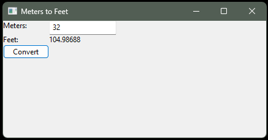

# Python Meters-to-Feet Desktop Converter

A beginner Python desktop application that converts a value in **meters** to **feet** using a graphical user interface built with **wxPython**.

This project was created as part of my hands-on Python learning journey. It helped me practice separating application logic into frontend and backend modules, working with GUI widgets and events, importing modules, converting user input, and packaging a Python application as a standalone Windows executable.

## Application Demo

Below is the working desktop application converting 32 meters to 104.98688 feet.



## Features

- Simple desktop GUI
- Accepts a value in meters
- Converts meters to feet
- Displays the converted result in the application window
- Separates conversion logic (`Backend.py`) from the GUI (`Frontend.py`)
- Can be packaged as a standalone Windows executable using PyInstaller

## Project Structure

```text
python-meters-to-feet/
├── Backend.py
├── Frontend.py
├── requirements.txt
├── .gitignore
└── README.md
```

## Conversion Logic

The application uses the following conversion:

```text
feet = meters × 3.28084
```

## Requirements

- Python
- wxPython

To recreate the standalone executable, PyInstaller is also required.

## Installation

Clone the repository and move into the project directory:

```bash
git clone <your-repository-url>
cd python-meters-to-feet
```

Install the required packages:

```bash
python -m pip install -r requirements.txt
```

## Run the Application

```bash
python Frontend.py
```

Enter a value in the **Meters** field and click **Convert**. The converted value will appear beside **Feet**.

## Build a Standalone Windows Executable

The project was packaged using PyInstaller with:

```bash
python -m PyInstaller --onefile --windowed Frontend.py
```

After a successful build, PyInstaller creates `build` and `dist` directories. The Windows executable is placed in:

```text
dist/Frontend.exe
```

The executable can be launched without manually running the Python script.

## What I Practiced

- Python functions
- Modules and imports
- Type conversion
- GUI development with wxPython
- Widgets and event handling
- Frontend/backend separation
- Python package installation
- Packaging Python applications with PyInstaller

## Learning Context

This is a beginner-level hands-on project created while learning Python fundamentals and desktop application development. My next goal is to apply Python to database and infrastructure automation use cases.

## Note

The current version expects a numeric value in the Meters field. Input validation and additional error handling can be added in a future enhancement.
